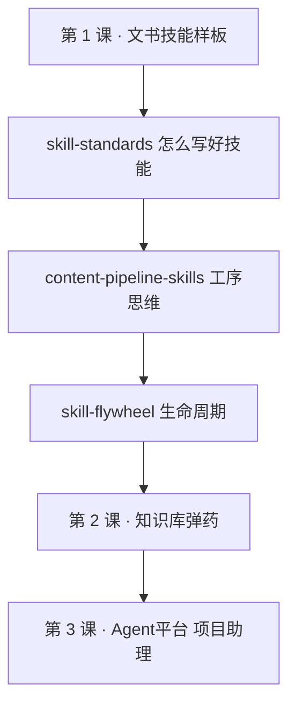

# 内容创作生产线 · 10 个 Skill 精选

> 文件路径：`/Users/apple/Documents/4.0 Sanyuan/2.4 环境公益"新"力量/course/part-01-skill/content-pipeline-skills.md`
>
> 用途：第 1 课「技能」课延伸阅读——把「技能」理解成一条可分工的内容生产线，而不是 Skill 收藏夹。网页阅读见同目录 `content-pipeline-skills.html`。
>
> 筛选标准：**能否让中文创作者更快产出可发布内容**（不按 Star、不按热度）。

**国内获取**：下列 Skill 若在 [SkillHub](https://skillhub.cn) 有对应条目，优先用 SkillHub 安装（`skillhub install <slug>`，见 [安装说明](https://skillhub.cn/install/skillhub.md)）；未收录的保留 GitHub 源码链接。

---

## 一、为什么要有这条「生产线」

Skill 一多，很容易变成收藏夹：看着都想装，真用起来一个都想不起。

解决办法不是再装更多，而是**按工序分工**——每一步只装一个、用熟再装下一个：

```text
选题 → 调研 → 写作 → 去 AI 味 → 封面 → 幻灯 → 信息图 → HTML 发布
```


**与本课的关系**：第 1 课你在 QoderWork 里做的「结项报告助手」，已经是生产线里**一个工序**（文书生成 + 输出契约 + Gotchas）。这篇清单展示的是**同一套思维**在内容创作场景的扩展——先想清楚「这一步解决什么」，再决定装哪个 Skill。

---

## 二、10 个 Skill · 按工序排序

### 1. stop-slop —— 先去 AI 味，再谈写作

| 项目 | 说明 |
|------|------|
| **工序** | 去 AI 味（写作之后、发布之前） |
| **获取** | [SkillHub · stop-slop](https://skillhub.cn/skills/stop-slop) · [GitHub 源码](https://github.com/hardikpandya/stop-slop) |
| **解决什么** | 删掉机器味：空洞转折、模板句、过度总结、假装深刻的废话 |

很多人以为最缺的是「写得更快」。错了——现在最缺的是「看起来不像 AI 写的」。AI 味一出来，读者会立刻防御；内容再对，信任也已经掉了。

**中文创作者最该先装的，不是写作增强器，而是 AI 味刹车。**

---

### 2. gzh-explosive-content-detector —— 公众号爆款选题

| 项目 | 说明 |
|------|------|
| **工序** | 选题 |
| **获取** | [SkillHub · gzh-explosive-content-detector](https://skillhub.cn/skills/gzh-explosive-content-detector) |
| **解决什么** | 按关键词搜公众号爆款文章，三维评分排序，找选题灵感与传播张力 |
| **备注** | 需配置红狐 API Key（`REDFOX_API_KEY`）；见 SkillHub 页安装说明 |

很多文章扑街，不是因为写得不够好，而是选题本身就没有传播张力。这个工具把「值不值得写」变成可查询的数据：阅读数、相关性、热度、时效。

它更像**内容编辑**：不是催你快写，而是先问——**这个赛道最近什么在爆？**

---

### 3. content-research-writer —— 调研与写作连起来

| 项目 | 说明 |
|------|------|
| **工序** | 调研 + 写作 |
| **获取** | [SkillHub · content-research-writer-cn](https://skillhub.cn/skills/content-research-writer-cn) · [GitHub 源码](https://github.com/ComposioHQ/awesome-claude-skills/tree/master/content-research-writer) |
| **解决什么** | 把内容研究和写作流程串联；适合长文、行业分析、趋势解读 |

选题定了、爆款也看了，下一步是**素材密度**。一篇好文章，表面是表达，底层是材料。没有足够信息、案例、背景和角度，AI 再会写，也只能把空话排列得更整齐。

写作不是从空白页开始，而是从**调研与素材**开始。

---

### 4. ima-skills —— 基于笔记与知识库写，少胡说

| 项目 | 说明 |
|------|------|
| **工序** | 调研 / 写作（有现成资料库时） |
| **获取** | [SkillHub · ima-skills](https://skillhub.cn/skills/ima-skills) |
| **解决什么** | 对接腾讯 ima：笔记与知识库的读取、检索、写入，围绕已有材料组织内容 |

如果你用 **ima** 管理课程笔记、访谈纪要、书籍摘录与资料库，这个比通用 NotebookLM 更贴近国内工作流。内容创作者最怕的不是写慢，而是**写错**——引用错、理解错、编造事实，信任成本极高。

**对照本课**：第 2 课知识库 + 第 1 课技能，本质上就是在搭「可引用的事实层」；ima-skills 是同一思路在个人知识工具链里的版本（需配置 ima OpenAPI 凭证）。

---

### 5. khazix-writer —— 深度研究与 AI 热点写作

| 项目 | 说明 |
|------|------|
| **工序** | 调研 + 写作（热点 / 长文） |
| **获取** | [SkillHub · khazix-writer](https://skillhub.cn/skills/khazix-writer) · [GitHub 源码](https://github.com/KKKKhazix/khazix-skills) |
| **解决什么** | 深度研究、AI 工具与行业趋势的信息整理与长文输出 |

适合 AI 工具、模型动态、技术热点类内容。AI 内容最容易遇到两个问题：信息更新快，读者要求高。写浅了像搬运，写深了容易慢。

更适合搭一个**热点研究工作台**：先整理信息，再往观点和长文走。

---

### 6. wan26-text-to-image —— 封面图，第一眼的点击理由

| 项目 | 说明 |
|------|------|
| **工序** | 封面 / 头图 |
| **获取** | [SkillHub · wan26-text-to-image](https://skillhub.cn/skills/wan26-text-to-image) |
| **解决什么** | 文生图出封面、头图；中文提示词友好，按平台比例与情绪出图 |

很多创作者低估了封面。在公众号、小红书与汇报场景里，封面不是装饰，而是**第一眼的点击理由**。文字负责说服，封面负责让别人先停下来。

---

### 7. guizang-html-to-pptx —— HTML 转幻灯片 / 多形态发布

| 项目 | 说明 |
|------|------|
| **工序** | 幻灯片 / 多平台拆分 |
| **获取** | [SkillHub · guizang-html-to-pptx](https://skillhub.cn/skills/guizang-html-to-pptx) |
| **解决什么** | 把 HTML 内容转为 PPTX 幻灯片，适合汇报、培训、机构宣介等场景 |

同一篇内容：发公众号可以是长文，对内汇报可能要 PPT，线下分享又要幻灯片。**平台不是容器，平台会改变内容形态。**

---

### 8. writing-style-baoyu —— 信息图与结构图（宝玉系）

| 项目 | 说明 |
|------|------|
| **工序** | 信息图 / 视觉表达 |
| **获取** | [SkillHub · writing-style-baoyu](https://skillhub.cn/skills/writing-style-baoyu) · [GitHub 源码](https://github.com/JimLiu/baoyu-skills) |
| **解决什么** | 信息图、结构图、方法论视觉化（宝玉技能集国内入口） |

干货文信息密度够了，读者仍可能看不进去——框架、流程、对比、清单，全靠文字会很累。把复杂逻辑变成图，让内容从「可读」变成**可保存**。

---

### 9. wechat-article-spider —— 正文配图与公号素材落盘

| 项目 | 说明 |
|------|------|
| **工序** | 正文配图 / 参考素材 |
| **获取** | [SkillHub · wechat-article-spider](https://skillhub.cn/skills/wechat-article-spider) |
| **解决什么** | 将微信公众号文章转为 Markdown，**图片本地化保存**，便于正文插图引用与二次编排 |

知识长文、观点文章、经验分享：全是大段文字读者会累。这个 Skill 不只抓文字——**把文内图片一并落盘**，你可以在改写时直接引用、裁剪、重组配图，而不必从零找图或忍受外链失效。

---

### 10. html-anything —— Markdown 到可发布作品

| 项目 | 说明 |
|------|------|
| **工序** | HTML 发布 |
| **获取** | [SkillHub · html-anything](https://skillhub.cn/skills/html-anything) · [GitHub 源码](https://github.com/nexu-io/html-anything) |
| **解决什么** | Markdown → 精美网页 / 海报 / 卡片化展示 |

很多创作者的最后一公里是排版。Markdown 写完了，要变成海报、落地页、好看的 HTML，还要折腾一堆工具。

**对照本课**：`report/index.html`、`course/index.html` 就是「写完还要能舒服地读」的发布层；html-anything 解决的是个人内容归档与展示质感。

写完不等于完成。**能被舒服地阅读，才算完成。**

---

## 三、怎么用这份清单（避免变收藏夹）

| 原则 | 做法 |
|------|------|
| **一次只装一个工序** | 先 stop-slop 或 gzh-explosive-content-detector，用熟再装下一个 |
| **description 写清工序** | 「Load when 用户要发布前润色 / 去 AI 味」—— 见 [`skill-standards.md`](skill-standards.md) |
| **和本课技能同构** | 每个 Skill = 文件夹 + 触发说明 + 输出契约 + Gotchas |
| **公益机构可迁移** | 结项报告、项目书、资助信 = 你们的「文书生产线」；这篇清单是**传播向内容**的平行参考 |

**建议起步组合（内容创作者）**

1. stop-slop（发布前必过）
2. gzh-explosive-content-detector（动笔前看爆款选题）
3. html-anything 或 guizang-html-to-pptx（按你主发平台二选一）

**建议起步组合（本课学员 · 公益文书）**

1. 本课 [`templates.html`](templates.html) 里的结项 / 项目书 / 资助信样板
2. [`skill-standards.md`](skill-standards.md) 里的触发说明与 Gotchas 写法
3. 有需要再装 stop-slop，专门清文书里的套话与 AI 味

---

## 四、工序 × Skill 速查表

| 工序 | 推荐 Skill | 国内获取 | 一句话 |
|------|-----------|----------|--------|
| 去 AI 味 | stop-slop | [SkillHub](https://skillhub.cn/skills/stop-slop) | 先删机器味，再谈文采 |
| 选题 | gzh-explosive-content-detector | [SkillHub](https://skillhub.cn/skills/gzh-explosive-content-detector) | 爆款数据帮你看赛道 |
| 调研 + 写作 | content-research-writer | [SkillHub](https://skillhub.cn/skills/content-research-writer-cn) | 素材密度决定上限 |
| 知识库写作 | ima-skills | [SkillHub](https://skillhub.cn/skills/ima-skills) | ima 笔记/知识库可检索 |
| 热点 / 深度写作 | khazix-writer | [SkillHub](https://skillhub.cn/skills/khazix-writer) | AI 与趋势类长文 |
| 封面 | wan26-text-to-image | [SkillHub](https://skillhub.cn/skills/wan26-text-to-image) | 让人先停下来 |
| 幻灯 / 多形态 | guizang-html-to-pptx | [SkillHub](https://skillhub.cn/skills/guizang-html-to-pptx) | 长文变汇报幻灯 |
| 信息图 | writing-style-baoyu | [SkillHub](https://skillhub.cn/skills/writing-style-baoyu) | 可保存的视觉干货 |
| 正文配图 | wechat-article-spider | [SkillHub](https://skillhub.cn/skills/wechat-article-spider) | 公号图文+图片落盘 |
| HTML 发布 | html-anything | [SkillHub](https://skillhub.cn/skills/html-anything) | 最后一公里的阅读质感 |

---

## 五、与本课其他材料的关系



- 讲师可在「概念辨析」后讲解工序分工，适合有内容传播、机构宣传需求的学员。
- 技能库变大后的维护见 [`skill-flywheel.md`](skill-flywheel.md)。
- 外部 Skill 由各自作者维护；国内优先经 [SkillHub](https://skillhub.cn) 安装，未收录的从 GitHub 获取源码。安装前请自行查看许可与隐私说明。
