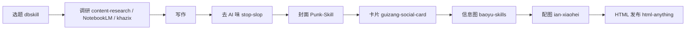
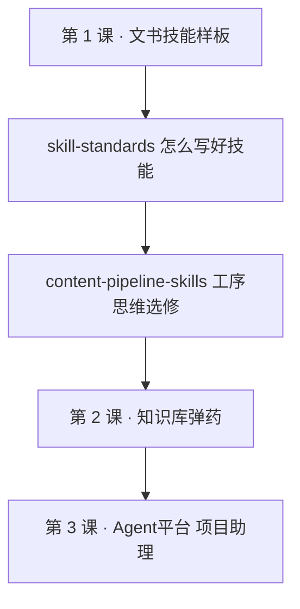

# 内容创作生产线 · 10 个 Skill 精选

> 文件路径：`/Users/apple/Documents/4.0 Sanyuan/2.4 环境公益"新"力量/course/part-01-skill/content-pipeline-skills.md`
>
> 用途：第 1 课「技能」课**选修延伸阅读**——把「技能」理解成一条可分工的内容生产线，而不是 Skill 收藏夹。网页阅读见同目录 `content-pipeline-skills.html`。
>
> 筛选标准：**能否让中文创作者更快产出可发布内容**（不按 Star、不按热度）。

---

## 一、为什么要有这条「生产线」

Skill 一多，很容易变成收藏夹：看着都想装，真用起来一个都想不起。

解决办法不是再装更多，而是**按工序分工**——每一步只装一个、用熟再装下一个：

```text
选题 → 调研 → 写作 → 去 AI 味 → 封面 → 卡片 → 信息图 → HTML 发布
```



**与本课的关系**：第 1 课你在 QoderWork 里做的「结项报告助手」，已经是生产线里**一个工序**（文书生成 + 输出契约 + Gotchas）。这篇清单展示的是**同一套思维**在内容创作场景的扩展——先想清楚「这一步解决什么」，再决定装哪个 Skill。

---

## 二、10 个 Skill · 按工序排序

### 1. stop-slop —— 先去 AI 味，再谈写作

| 项目 | 说明 |
|------|------|
| **工序** | 去 AI 味（写作之后、发布之前） |
| **仓库** | [hardikpandya/stop-slop](https://github.com/hardikpandya/stop-slop) |
| **解决什么** | 删掉机器味：空洞转折、模板句、过度总结、假装深刻的废话 |

很多人以为最缺的是「写得更快」。错了——现在最缺的是「看起来不像 AI 写的」。AI 味一出来，读者会立刻防御；内容再对，信任也已经掉了。

**中文创作者最该先装的，不是写作增强器，而是 AI 味刹车。**

---

### 2. dbskill —— 选题不成立，后面全白写

| 项目 | 说明 |
|------|------|
| **工序** | 选题 |
| **仓库** | [dontbesilent2025/dbskill](https://github.com/dontbesilent2025/dbskill) |
| **解决什么** | 先判断值不值得写：选题诊断、爆款拆解、Hook 优化 |

很多文章扑街，不是因为写得不够好，而是选题本身就没有传播张力。没人关心，标题再顺也没用；冲突不够，结构再完整也只是自嗨。

它更像**内容编辑**：不是催你快写，而是先问——**这个东西凭什么让人停下来？**

---

### 3. content-research-writer —— 调研与写作连起来

| 项目 | 说明 |
|------|------|
| **工序** | 调研 + 写作 |
| **仓库** | [ComposioHQ/awesome-claude-skills/content-research-writer](https://github.com/ComposioHQ/awesome-claude-skills/tree/master/content-research-writer) |
| **解决什么** | 把内容研究和写作流程串联；适合长文、行业分析、趋势解读 |

很多创作者卡住，不是不会写，而是**素材不够**。一篇好文章，表面是表达，底层是材料。没有足够信息、案例、背景和角度，AI 再会写，也只能把空话排列得更整齐。

写作不是从空白页开始，而是从**素材密度**开始。

---

### 4. NotebookLM Skill —— 基于知识库写，少胡说

| 项目 | 说明 |
|------|------|
| **工序** | 调研 / 写作（有现成资料库时） |
| **仓库** | [PleasePrompto/notebooklm-skill](https://github.com/PleasePrompto/notebooklm-skill) |
| **解决什么** | 围绕已有材料组织内容，**减少幻觉** |

如果你经常基于课程、访谈、会议纪要、书籍摘录、资料库来写，这个非常值得装。内容创作者最怕的不是写慢，而是**写错**——引用错、理解错、编造事实，信任成本极高。

**对照本课**：第 2 课知识库 + 第 1 课技能，本质上就是在搭「可引用的事实层」；NotebookLM Skill 是同一思路在内容创作工具链里的版本。

---

### 5. khazix-skills —— 深度研究与 AI 热点

| 项目 | 说明 |
|------|------|
| **工序** | 调研（热点 / 长文） |
| **仓库** | [KKKKhazix/khazix-skills](https://github.com/KKKKhazix/khazix-skills) |
| **解决什么** | 深度研究、AI 工具与行业趋势的信息整理 |

适合 AI 工具、模型动态、技术热点类内容。AI 内容最容易遇到两个问题：信息更新快，读者要求高。写浅了像搬运，写深了容易慢。

更适合搭一个**热点研究工作台**：先整理信息，再往观点和长文走。

---

### 6. Punk-Skill —— 封面图，第一眼的点击理由

| 项目 | 说明 |
|------|------|
| **工序** | 封面 |
| **仓库** | [adrianpunk/Punk-Skill](https://github.com/adrianpunk/Punk-Skill) |
| **解决什么** | 封面图、头像；中文标题友好；按平台比例与情绪出图 |

很多创作者低估了封面。在 X、公众号、小红书里，封面不是装饰，而是**第一眼的点击理由**。文字负责说服，封面负责让别人先停下来。

---

### 7. guizang-social-card-skill —— 小红书与公众号卡片

| 项目 | 说明 |
|------|------|
| **工序** | 卡片 / 多平台拆分 |
| **仓库** | [op7418/guizang-social-card-skill](https://github.com/op7418/guizang-social-card-skill) |
| **解决什么** | 社交卡片、公众号封面、小红书图文拆分 |

同一篇内容：发 X 可以是长文，发小红书可能要拆成 6 张卡片，发公众号又需要封面和导语。**平台不是容器，平台会改变内容形态。**

---

### 8. baoyu-skills —— 信息图与结构图

| 项目 | 说明 |
|------|------|
| **工序** | 信息图 |
| **仓库** | [JimLiu/baoyu-skills](https://github.com/JimLiu/baoyu-skills) |
| **解决什么** | 信息图、结构图、方法论视觉化 |

干货文信息密度够了，读者仍可能看不进去——框架、流程、对比、清单，全靠文字会很累。把复杂逻辑变成图，让内容从「可读」变成**可保存**。

---

### 9. ian-xiaohei-illustrations —— 正文配图要有人味

| 项目 | 说明 |
|------|------|
| **工序** | 正文配图 |
| **仓库** | [helloianneo/ian-xiaohei-illustrations](https://github.com/helloianneo/ian-xiaohei-illustrations) |
| **解决什么** | 手绘感正文插图，做情绪缓冲与记忆点 |

知识长文、观点文章、经验分享：全是大段文字读者会累，配图太商业又像广告。小黑风格有手绘感、有人味——不是所有内容都需要炫酷视觉，有时候一点手绘感反而更像人写的。

---

### 10. html-anything —— Markdown 到可发布作品

| 项目 | 说明 |
|------|------|
| **工序** | HTML 发布 |
| **仓库** | [nexu-io/html-anything](https://github.com/nexu-io/html-anything) |
| **解决什么** | Markdown → 精美网页 / 海报 / 卡片化展示 |

很多创作者的最后一公里是排版。Markdown 写完了，要变成海报、落地页、好看的 HTML，还要折腾一堆工具。

**对照本课**：`report/index.html`、`course/index.html` 就是「写完还要能舒服地读」的发布层；html-anything 解决的是个人内容归档与展示质感。

写完不等于完成。**能被舒服地阅读，才算完成。**

---

## 三、怎么用这份清单（避免变收藏夹）

| 原则 | 做法 |
|------|------|
| **一次只装一个工序** | 先 stop-slop 或 dbskill，用熟再装下一个 |
| **description 写清工序** | 「Load when 用户要发布前润色 / 去 AI 味」—— 见 [`skill-standards.md`](skill-standards.md) |
| **和本课技能同构** | 每个 Skill = 文件夹 + 触发说明 + 输出契约 + Gotchas |
| **公益机构可迁移** | 结项报告、项目书、资助信 = 你们的「文书生产线」；这篇清单是**传播向内容**的平行参考 |

**建议起步组合（内容创作者）**

1. stop-slop（发布前必过）
2. dbskill（动笔前选题）
3. html-anything 或 guizang-social-card（按你主发平台二选一）

**建议起步组合（本课学员 · 公益文书）**

1. 本课 [`templates.html`](templates.html) 里的结项 / 项目书 / 资助信样板
2. [`skill-standards.md`](skill-standards.md) 里的触发说明与 Gotchas 写法
3. 有需要再装 stop-slop，专门清文书里的套话与 AI 味

---

## 四、工序 × Skill 速查表

| 工序 | 推荐 Skill | 一句话 |
|------|-----------|--------|
| 去 AI 味 | stop-slop | 先删机器味，再谈文采 |
| 选题 | dbskill | 值不值得写，比快写更重要 |
| 调研 + 写作 | content-research-writer | 素材密度决定上限 |
| 知识库写作 | NotebookLM Skill | 有资料库时少幻觉 |
| 热点 / 深度调研 | khazix-skills | AI 与趋势类长文 |
| 封面 | Punk-Skill | 让人先停下来 |
| 卡片 / 多平台 | guizang-social-card-skill | 同一内容，不同形态 |
| 信息图 | baoyu-skills | 可保存的视觉干货 |
| 正文配图 | ian-xiaohei-illustrations | 手绘感，不像广告 |
| HTML 发布 | html-anything | 最后一公里的阅读质感 |

---

## 五、与本课其他材料的关系



- 本篇为**选修**，不影响本课验收（≥1 个文书技能跑通）。
- 讲师可在「概念辨析」后推荐给有内容传播、机构宣传需求的学员。
- 外部 Skill 仓库由各自作者维护；安装前请自行查看许可与隐私说明。
