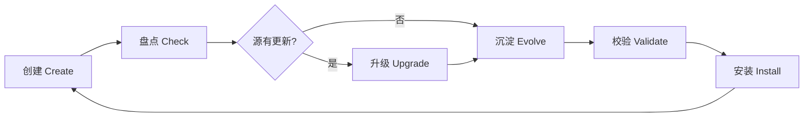
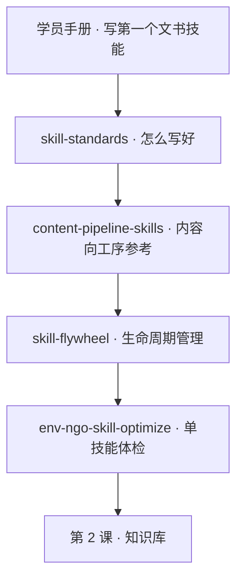

# 技能生命周期飞轮 · skill_flywheel

> 文件路径：`/Users/apple/Documents/4.0 Sanyuan/2.4 环境公益"新"力量/course/part-01-skill/skill-flywheel.md`
>
> 用途：第 1 课「技能」课的**创建 → 检查 → 升级 → 沉淀 → 校验 → 安装**全流程参考。网页阅读见同目录 `skill-flywheel.html`。
>
> 开源项目：[AlataChan/skill_flywheel](https://github.com/AlataChan/skill_flywheel)（本页为课程中文版导读，命令以仓库 README 为准）。

---

## 一、为什么需要「飞轮」

第 1 课教你写出第一个文书技能，第九节的 skillopt 教你「评测没过怎么改」。但真实机构会遇到更深一层的问题：

| 困境 | 典型表现 |
|------|---------|
| 技能散落 | 结项、项目书、资助信各写各的，没有统一目录 |
| 源仓库更新了 | GitHub 上的 Skill 有新 commit，本地还是旧版 |
| 经验丢失 | 改 `SKILL.md` 补了一条 Gotcha，升级后被覆盖 |
| 不敢挂载 | 不确定脚本能不能跑、触发说明有没有写错 |

**skill_flywheel** 把上述环节串成一条可重复执行的闭环——不是再装一个 Skill，而是**管理你已有 Skills 的方法论 + 工具链**。



一句话：**技能写完只是起点；飞轮让「好用、可更新、经验不丢」变成例行操作。**

---

## 二、飞轮里七个工具，各管一截

项目仓库把生命周期拆成 7 个可组合子技能，由 `skill_flywheel` 统一编排：

| 子技能 | 工序 | 解决什么 |
|--------|------|---------|
| [github-to-skills](https://github.com/AlataChan/skill_flywheel/tree/main/github-to-skills) | **创建** | 从 GitHub URL 打包生成 skill 文件夹（含 `github_hash`） |
| [skill-creator](https://github.com/AlataChan/skill_flywheel/tree/main/skill-creator) | **规范** | 手工脚手架与命名约定（kebab-case、argparse、不写死路径） |
| [skill-manager](https://github.com/AlataChan/skill_flywheel/tree/main/skill-manager) | **盘点** | 扫描、列出、检查远程是否落后、删除 |
| [skill-upgrader](https://github.com/AlataChan/skill_flywheel/tree/main/skill-upgrader) | **升级** | 更新 `github_hash`、刷新 README 摘要、重新缝合经验 |
| [skill-evolution-manager](https://github.com/AlataChan/skill_flywheel/tree/main/skill-evolution-manager) | **沉淀** | 对话复盘 → `evolution.json` → stitch 回 `SKILL.md` |
| [skill-validator](https://github.com/AlataChan/skill_flywheel/tree/main/skill-validator) | **校验** | frontmatter、脚本编译、单测 |
| [skill-installer-local](https://github.com/AlataChan/skill_flywheel/tree/main/skill-installer-local) | **安装** | 复制到本机 `~/.codex/skills` 或 `~/.claude/skills` |

**编排入口**：`skill_flywheel/scripts/flywheel.py`——一条命令委托上述脚本，不必记七个路径。

---

## 三、四个核心概念（读懂就能上手）

### 3.1 `skills_root` —— 技能放哪

所有 skill 文件夹的**父目录**。每个子文件夹一个 skill，内含 `SKILL.md`：

```text
skills_root/
├── env-ngo-closure-report/
├── env-ngo-proposal-draft/
└── stop-slop/          # 从 GitHub 打包来的第三方 skill
```

克隆 [skill_flywheel](https://github.com/AlataChan/skill_flywheel) 后，仓库根目录即 `skills_root`；本机安装后常见路径为 `~/.codex/skills`。

### 3.2 `github_url` + `github_hash` —— 版本快照

从 GitHub 打包的 skill，在 `SKILL.md` frontmatter 里记录：

- `github_url`：源仓库地址
- `github_hash`：打包时远程 HEAD 的 commit hash

`skill-manager` 用 `git ls-remote` 比对本地 hash 与远程——不等则标记 **outdated**，提示你该升级了。

### 3.3 `evolution.json` —— 经验的事实源

用户验证有效的偏好、约束、修复点，写入 JSON，**不直接手改** `SKILL.md` 里的自动区块。

推荐字段：

| 字段 | 含义 | 公益文书示例 |
|------|------|-------------|
| `preferences` | 输出风格偏好 | 「结项报告反思段用第一人称复数」 |
| `constraints` | 硬约束 | 「受益人姓名一律脱敏为 A/B」 |
| `fixes` | 已知坑点 | 「缺成效数据时列缺失项，禁止编造」 |
| `contexts` | 环境差异 | 「资助方模板为 Word，先转 Markdown 再喂」 |

### 3.4 `stitch` —— 智能缝合

把 `evolution.json` 渲染进 `SKILL.md` 中由标记包裹的区块：

```markdown
<!-- skill-evolution-manager:begin -->
## User-Learned Best Practices & Constraints
…自动生成的经验列表…
<!-- skill-evolution-manager:end -->
```

**价值**：升级覆盖 `SKILL.md` 主体时，经验可从 `evolution.json` **反复重建**，不会丢。

---

## 四、环境准备与统一入口

### 4.1 克隆与依赖

```bash
git clone https://github.com/AlataChan/skill_flywheel.git
cd skill_flywheel

python3 -m venv .venv
source .venv/bin/activate
python -m pip install pyyaml pytest   # validate 需要 pyyaml；跑测试需要 pytest
```

### 4.2 飞轮命令速查

在仓库根目录执行（路径以你克隆位置为准）：

```bash
# 从 GitHub 创建一个新 skill
python3 skill_flywheel/scripts/flywheel.py create --url <github_url>

# 列出 / 检查更新
python3 skill_flywheel/scripts/flywheel.py list --format table
python3 skill_flywheel/scripts/flywheel.py check --format table

# 升级（先预览再写入）
python3 skill_flywheel/scripts/flywheel.py upgrade --name <skill_name> --dry-run
python3 skill_flywheel/scripts/flywheel.py upgrade --name <skill_name> --yes

# 沉淀经验（stdin 传入 JSON）
cat <<'JSON' | python3 skill_flywheel/scripts/flywheel.py evolve --name <skill_name> --stdin
{"fixes":["缺数据时列缺失项，不编造成效数字"]}
JSON

# 批量重新缝合（升级后恢复经验区块）
python3 skill_flywheel/scripts/flywheel.py align

# 校验
python3 skill_flywheel/scripts/flywheel.py validate --format table

# 安装到本机 skills 目录
python3 skill_flywheel/scripts/flywheel.py install --yes

# 一键跑完整飞轮（会升级，必须 --yes）
python3 skill_flywheel/scripts/flywheel.py cycle --yes
```

**安全约定**：破坏性操作默认 **dry-run**；真正写入磁盘需显式加 `--yes`。

---

## 五、推荐学习顺序（课堂可跟做）

| 步骤 | 做什么 | 学会什么 |
|:---:|--------|---------|
| 1 | 读本文 + 仓库 README | 理解飞轮为何存在 |
| 2 | `create --url` 打包一个 GitHub Skill（如 stop-slop） | 看懂 `github_url` / `github_hash` |
| 3 | `list` + `check` | 会读 current / outdated 报告 |
| 4 | 用真实任务跑 skill，失败后记一条 `fixes` → `evolve --stdin` | `evolution.json` 优于直接改正文 |
| 5 | `validate` | 挂载前的自检清单 |
| 6 | `upgrade --dry-run` → `--yes`（若源仓库有新 commit） | 升级不丢经验的机制 |
| 7 | `cycle --yes`（可选） | 把维护变成例行操作 |

**最小闭环演示**（讲师 15 分钟）：

```text
create（打包 gzh-explosive-content-detector 或 wechat-article-spider）
  → 手动跑一条调研写作任务
  → evolve 写入 1 条 fix
  → validate 通过
  → check 显示 outdated 时 upgrade --yes
  → 确认 stitch 区块仍在
```

---

## 六、与本课其他材料的关系



| 材料 | 分工 |
|------|------|
| [`README.md`](README.md) 第八～九节 | 单技能评测与 skillopt 迭代 |
| **本篇 skill-flywheel** | **多技能目录**的创建、版本、经验沉淀与批量校验 |
| [`content-pipeline-skills.md`](content-pipeline-skills.md) | 内容创作场景的工序 Skill 清单 |
| [`skill-standards.md`](skill-standards.md) | Anthropic / Perplexity 工程规范中文导读 |

**对照理解**：

- **skillopt**（`env-ngo-skill-optimize`）= 给**一个**技能做体检，适合本课刚写完的结项/项目书技能。
- **skill_flywheel** = 管理**一批**技能（含从 GitHub / SkillHub 引入的第三方 skill），适合机构技能库逐渐变多之后。

---

## 七、公益机构迁移场景

| 场景 | 飞轮怎么用 |
|------|-----------|
| 引入 SkillHub 上的 stop-slop | `create --url` 或 SkillHub 安装后，纳入 `check` 例行扫描 |
| 结项技能 Gotcha 越积越多 | 写入 `evolution.json`，不要只堆在 `SKILL.md` 正文里 |
| 第 3 课挂载前 | `validate` 确保 frontmatter 与脚本无硬编码路径 |
| 团队换人 | `list` 出技能清单 + `evolution.json` 即机构隐性 SOP |
| 合规 | 升级第三方 skill 前 `--dry-run` 看 diff；敏感模板不进 `evolution.json` |

---

## 八、与国内 SkillHub 的配合

[`content-pipeline-skills.md`](content-pipeline-skills.md) 中的 Skill 可经 [SkillHub](https://skillhub.cn) 安装（`skillhub install <slug>`）。装好后建议：

1. 把 skill 目录纳入你的 `skills_root`；
2. 用 `flywheel.py check` 跟踪源仓库是否更新；
3. 机构定制经验写入 `evolution.json`，用 `evolve` / `align` 缝合，避免与上游 `SKILL.md` 冲突。

GitHub 访问不便时：**安装走 SkillHub，维护走 flywheel**——两条链路互补。

---

## 九、延伸阅读

- 项目 README：[github.com/AlataChan/skill_flywheel](https://github.com/AlataChan/skill_flywheel)
- 经验沉淀协议：`skill-evolution-manager/SKILL.md`（`/evolve` 约定与 JSON schema）
- 本课单技能优化：[`skills/env-ngo-skill-optimize/SKILL.md`](skills/env-ngo-skill-optimize/SKILL.md)
