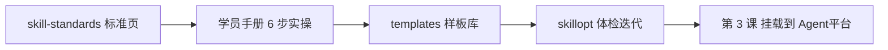

# 技能标准与工程实践 · 延伸阅读

> 文件路径：`/Users/apple/Documents/4.0 Sanyuan/2.4 环境公益"新"力量/course/part-01-skill/skill-standards.md`
>
> 用途：第 1 课「技能」课的**标准定义 + 工程实践**参考页。网页阅读见同目录 `skill-standards.html`。
>
> 完整英文原文：`references/claude_agent_skills.md`（Anthropic 官方）、`references/skills_perplexity.md`（Perplexity 工程团队）

---

## 一、为什么要读这两份材料

第 1 课在 QoderWork 里用「一个角色 = 一个最小技能」快速落地。但要写出**好用、可维护、不误触发**的技能，需要理解业界共识：

| 材料 | 来源 | 解决什么问题 |
|------|------|-------------|
| Agent Skills 官方说明 | Anthropic | **是什么**：文件夹结构、三层加载、`SKILL.md` 规范 |
| Designing Agent Skills at Perplexity | Perplexity Agents 团队 | **怎么写好**：路由触发、Gotchas、评测与维护 |

本页用中文提炼要点，并**对照本课练习路径**。细节以 `references/` 下原文为准。

---

## 二、官方定义：Agent Skill 是什么（Anthropic）

### 2.1 技能 vs 一次性提示词

- **一次性提示词**：只服务当前这一轮对话，用完即丢。
- **技能（Skill）**：把流程、输出格式、边界规则封装成**可复用模块**；相关时由系统自动加载，不必每次重讲。

对本课而言：你在 QoderWork 里写的「结项报告助手」角色，就是最小可用技能；第 3 课再迁入 Agent平台 工作流。

### 2.2 三层渐进加载（Progressive Disclosure）

技能内容分三层进入上下文，**只有被用到才占 token**：

| 层级 | 何时加载 | 大约 token 成本 | 内容 |
|------|---------|----------------|------|
| **L1 元数据** | 会话启动时始终可见 | ~100 / 技能 | YAML 里的 `name`、`description` |
| **L2 指令正文** | 技能被触发时 | <5k | `SKILL.md` 主体：流程、输出契约、Gotchas |
| **L3 资源与脚本** | 按需读取 | 几乎不限 | `assets/` 模板、`scripts/` 校验脚本、附属 md |

```text
my-skill/
├── SKILL.md          # L1 frontmatter + L2 正文
├── assets/           # L3 模板、范例
└── scripts/          # L3 确定性脚本（结果进上下文，代码本身不占 token）
```

**本课对照**：触发说明 ≈ L1 `description`；输出契约 + Gotchas ≈ L2；`templates.html` 里的模板与 `check_sections.mjs` ≈ L3。

### 2.3 `SKILL.md` 最低要求

```yaml
---
name: your-skill-name          # 小写、连字符，≤64 字符
description: 做什么 + 何时加载；这是路由触发器，不是内部说明书
---

# 技能名称

## 何时使用 / 工作流 / 输出契约 / Gotchas …
```

- `description` **必须**写清「什么时候该加载」，而不是「这个技能很厉害」。
- 正文写**机构特有**的流程与边界；模型已会的内容不要重复堆砌。

---

## 三、工程实践：如何写好技能（Perplexity）

> 原文：[Designing, Refining, and Maintaining Agent Skills at Perplexity](https://research.perplexity.ai/articles/designing-refining-and-maintaining-agent-skills-at-perplexity)

### 3.1 写代码的直觉，很多不适用于技能

| Python 之禅 | 技能之禅 |
|-------------|---------|
| Simple is better than complex | 技能是一个**文件夹**，复杂度可以是特性 |
| Explicit is better than implicit | **激活靠隐式模式匹配** + 渐进披露 |
| Sparse is better than dense | 上下文昂贵，**每 token 都要高信号** |
| Special cases aren't special enough… | **Gotchas 就是那些特例**（最高价值内容） |
| If the implementation is easy to explain… | **若一眼能懂，模型本来就会——删掉** |

### 3.2 技能的四个维度

1. **是一个目录**：不止 `SKILL.md`，还有 `scripts/`、`references/`、`assets/`、`config.json` 等。
2. **是一种格式**：`name` 与文件夹名一致；`description` 是**路由触发器**。
3. **可被调用**：运行时按需 `load`，不是全文塞进系统提示词。
4. **渐进展开**：索引（全员付费）→ 正文（加载后付费）→ 附属文件（用时才付费）。

### 3.3 何时需要技能 / 何时不需要

**需要**，当：

- 没有额外上下文，智能体会**做错**或**不稳定**；
- 知识耐久但不在训练数据里（机构 SOP、资助方模板、口味与风格）；
- 需要跨多次运行**高度一致**（结项报告六章节、脱敏规则）。

**不需要**，当：

- 只是把一串 git 命令写进技能——模型本来就会；
- 内容与系统提示词重复——应放全局，不要做成条件加载技能；
- 依赖频繁变更的外部 API/MCP——会漂移。

**每个技能都是「税」**：索引里每多一个技能，**每个会话、每个用户**都要为它的 `description` 付 token。加技能前问：**没有这句，智能体会错吗？**

### 3.4 构建顺序（推荐）

```text
Step 0  先写评测用例（含负例：不该加载的场景）
Step 1  写 description（最难一行：「Load when…」用户真实说法，≤50 词）
Step 2  写正文（跳过显而易见步骤；重点写 Gotchas 与输出契约）
Step 3  重内容拆到 assets/、scripts/（条件分支不要全堆在 SKILL.md）
Step 4  在分支上迭代，小改 description 也会影响其他技能路由
Step 5  发布；之后主要靠追加 Gotchas 维护
```

**Description 范例（资助场景）**

- ❌ 「本技能用于监控 Pull Request 的状态。」（说明功能）
- ✅ 「Load when 用户说 babysit / watch CI / make sure this lands，需要盯着 PR 直到合并或明确失败。」（用户意图）

**正文范例**

- ❌ `git log` → `git checkout` → `git cherry-pick` …（说明书式罗列）
- ✅ 「把提交 cherry-pick 到干净分支；保留意图解决冲突；合不进去就说明原因。」（给目标，不给脆弱命令链）

### 3.5 Gotchas 飞轮（上线后维护）

| 现象 | 动作 |
|------|------|
| 智能体在某步失败 | 追加一条 Gotcha（负例） |
| 误加载本技能 | 收紧 description + 加负例评测 |
| 该加载却没加载 | description 加关键词 + 加正例评测 |
| 系统提示词变更 | 检查是否与技能正文重复/冲突 |

技能是 **append-mostly**：上线后少改正文大段，**多攒 Gotchas**。改 description 前必须有评测支撑。

---

## 四、对照本课：从标准到练习

| 标准概念 | 本课落点 |
|---------|---------|
| L1 `description` | QoderWork 角色「触发说明」；三版改写（功能版 → 意图版 → 带边界版） |
| L2 输出契约 + Gotchas | 学员手册 Step 3–4；结项报告六章节 |
| L3 assets / scripts | `templates.html` 样板库；`check_sections.mjs` 章节校验 |
| 先写评测 | `skillopt` 样板 + `eval_template.md` |
| 技能体检 | 健康分 ≥9 再挂载到第 3 课项目助理 |
| 虚构脱敏铁律 | 公开课程材料不得含真实机构/人名；仅借真实文档**格式** |

**建议阅读顺序**

1. 本页（中文要点）→ 2. 学员手册实操 → 3. `templates.html` _fork 一个样板_ → 4. 需要深挖时读 `references/` 原文

---

## 五、完整原文

| 文档 | 路径 | 说明 |
|------|------|------|
| Anthropic · Agent Skills | `references/claude_agent_skills.md` | 官方定义、三层加载、安全与限制 |
| Perplexity · 技能设计与维护 | `references/skills_perplexity.md` | 工程实践、评测、Gotchas 飞轮 |

---

## 六、与本课其他材料的关系



- 课前未读不影响上课；讲师可在第 1 课「概念辨析」后推荐自学。
- 第 2 课起，技能与知识库分工见 `part-02-knowledge-base/`。
