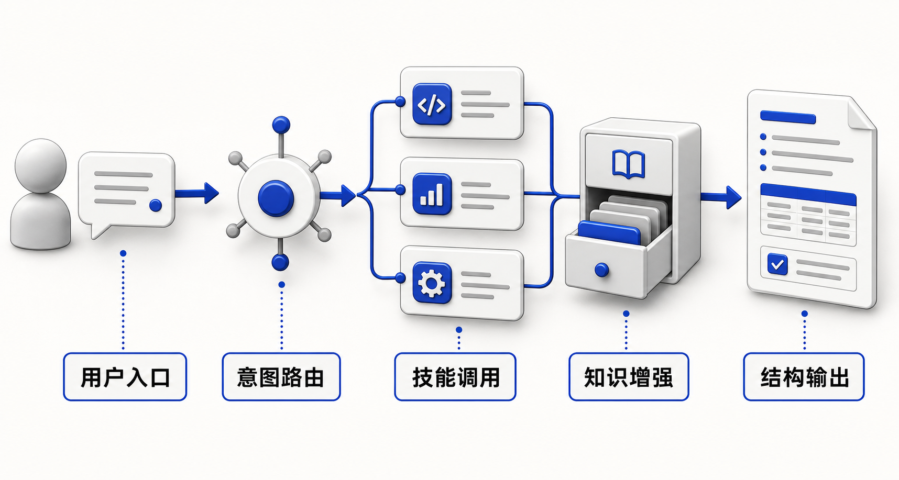
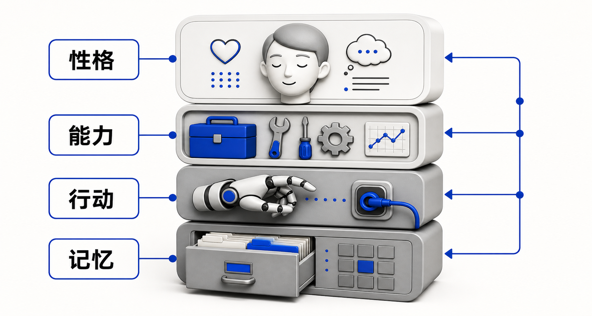
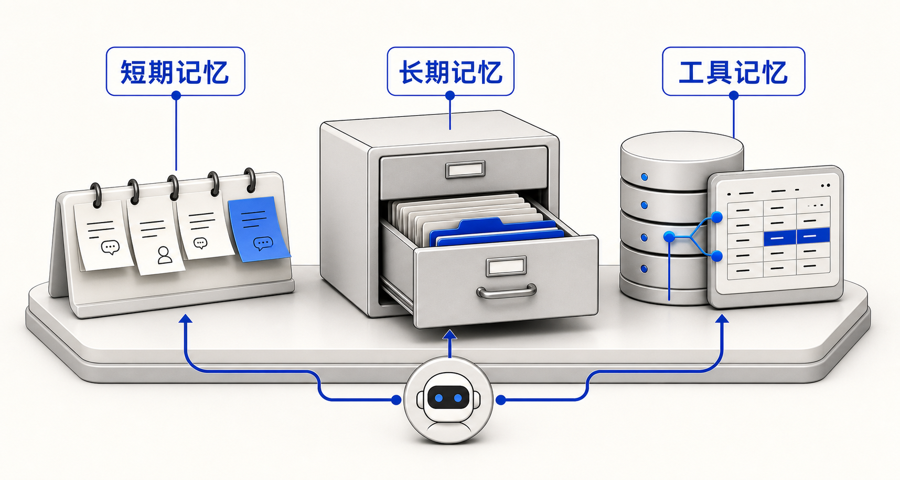

# 第 3 课 · AI智能体编排：组装「项目助理」（学员手册）

> 文件路径：`/Users/apple/Documents/4.0 Sanyuan/2.4 环境公益"新"力量/course/part-03-agent/README.md`
>
> 时长 120 分钟　|　课后产出：项目助理 AI 智能体调试通过
>
> 前置：完成第 1 课「技能构建」+ 第 2 课「知识库实战」，手上有 ≥1 个技能 + ≥1 个知识库。

---

## 一、这节课要解决什么

前两课分别解决了「怎么做」（技能）和「有什么」（知识库），但它们各自独立——用户得记住哪个技能对应什么场景，还得手动切换知识库。这就像厨房里菜谱和食材都备齐了，但没有厨师把它们串起来。

第 3 课的目标：把多个技能和知识库**编排**成一个统一的**项目助理**。用户只需要开口说一句话，项目助理自动判断意图、选对技能、查对知识库、输出结构化回答。

一句话：**项目助理 = 统一入口 + 多技能路由 + 知识库增强。**

## 二、项目助理架构



```text
┌──────────────────────────────────────────────┐
│                  用户入口                      │
│          （扫码 / 链接 / 嵌入网页）              │
└──────────────────┬───────────────────────────┘
                   │
                   ▼
┌──────────────────────────────────────────────┐
│              意图识别层                        │
│   用户说了什么 → 分到哪个技能？                  │
│   ┌────────┬────────┬────────┬────────┐      │
│   │ 文书   │ 案例   │ 传播   │ 综合   │      │
│   │ 类意图 │ 类意图 │ 类意图 │ 问答   │      │
│   └───┬────┴───┬────┴───┬────┴───┬────┘      │
└───────┼────────┼────────┼────────┼────────────┘
        │        │        │        │
        ▼        ▼        ▼        ▼
┌──────────────────────────────────────────────┐
│              技能路由层                        │
│   根据意图加载对应技能的 SOP + 输出契约          │
│   （结项报告 / 项目书 / 案例检索 / 推文…）       │
└──────────────────┬───────────────────────────┘
                   │
                   ▼
┌──────────────────────────────────────────────┐
│            知识库 RAG 增强                     │
│   从云端知识库检索相关文档切片                    │
│   补充事实、案例、数据，减少幻觉                  │
└──────────────────┬───────────────────────────┘
                   │
                   ▼
┌──────────────────────────────────────────────┐
│            格式化输出                          │
│   按技能定义的输出契约组织回答                    │
│   标注来源 / 缺失项 / 置信度                    │
└──────────────────────────────────────────────┘
```

**核心思路**：用户不需要知道背后有几个技能、几个知识库——只需要一个入口，说清楚自己要什么。

## 三、三个必须讲清楚的概念图

### 3.1 完整智能体不是一段提示词



一个完整的 AI 智能体，至少由四个部分共同构成：

| 要素 | 本课说法 | 对应配置 |
|------|----------|----------|
| 性格 | 它是谁、用什么语气、有什么红线 | 系统提示词 |
| 能力 | 它会做哪些事 | 第 1 课沉淀的技能 |
| 行动 | 它能调用哪些外部能力 | 工作流节点、插件、知识库检索 |
| 记忆 | 它能基于什么材料回答 | 第 2 课知识库 + 对话上下文 |

这张图要帮助学员建立一个边界：**系统提示词只是性格，不等于完整智能体**。如果只有提示词，没有技能、工具和知识库，项目助理很容易变成「听起来会做事，但实际没有抓手」的聊天窗口。

### 3.2 知识库只是长期记忆



学员常把「知识库」理解成智能体的全部记忆，但真实使用时至少要分三层：

| 记忆层 | 解决什么 | 常见误区 |
|--------|----------|----------|
| 短期记忆 | 当前对话里刚说过的信息 | 对话太长后会被上下文窗口挤掉 |
| 长期记忆 | 机构项目、报告、案例、模板等沉淀资料 | 需要先上传、清洗、分层，不能凭空记住 |
| 工具记忆 | 外部表格、数据库、项目系统里的结构化数据 | 基础课不强制接入，但要知道它和知识库不同 |

这张图要帮助学员理解：第 2 课建的知识库主要解决**长期记忆**，它不能自动解决所有「忘记」问题，也不能替代实时数据库。

## 四、课堂四步

### 4.1 Agent平台 首配（25 分钟）

1. **注册**：打开 Agent平台（yuanqi.tencent.com），用微信扫码注册/登录
2. **工作区**：创建「XX机构项目助理」工作区（XX = 你的机构简称）
3. **Fork 模板**：从课程提供的「环境公益项目助理·主模板」Fork 一份到自己工作区
4. **自定义**：
   - 机构名称：把模板里的「XX机构」替换成你的真实机构名
   - 欢迎语：改成你机构的语气，例如「你好，我是 XX 的项目助理，可以帮你写文书、查案例、做传播内容。」
   - 系统提示词：确认角色定位（你是XX机构的项目助理）、边界（只回答与本机构项目相关的问题）

### 4.2 挂载技能与知识库（35 分钟）

**技能挂载**：把第 1 课做的技能嵌入系统提示词的触发条件中：

```text
## 技能路由规则
- 当用户提到「结项报告」「项目总结」「执行报告」→ 加载【结项报告技能】
- 当用户提到「项目书」「立项」「申请书」→ 加载【项目书技能】
- 当用户提到「资助信」「申请信」「项目摘要」→ 加载【资助信技能】
- 其他问题 → 综合问答模式，优先从知识库检索
```

**知识库挂载**：
1. 将第 2 课整理好的 L1/L2 文档上传到 Agent平台 的云端知识库
2. 配置检索参数（Top-K、相似度阈值）
3. 在系统提示词里加一句：「回答前先查阅知识库，优先使用知识库中的真实信息，不要编造」

**调试 5 个真实问题**：

| # | 测试问题 | 期望行为 | 实际表现 | 修改 |
|---|---------|---------|---------|------|
| 1 | 「帮我写结项报告」 | 加载结项技能 + 查知识库 | | |
| 2 | 「XX基金会的申请要求是什么」 | 走综合问答 + 检索资助指南 | | |
| 3 | 「把这段改成朋友圈文案」 | 走传播技能（如有）或综合 | | |
| 4 | 「去年我们做了几个项目」 | 查知识库，列出项目清单 | | |
| 5 | 「帮我算一下预算」 | 礼貌拒绝或提示超出能力范围 | | |

### 4.3 按模块升级工作流（50 分钟）

当简单的「意图 → 技能 → 回答」不够用时，用工作流把多步骤串起来。三个模块各升级一个工作流：

#### M1 文书链工作流

```text
用户上传流水账
    │
    ▼
[Step 1] 材料预处理
    │  提取关键信息（活动、时间、人数、产出）
    │  标注缺失项
    ▼
[Step 2] 知识库检索
    │  查找同类项目的历年报告作为参考
    │  提取资助方模板要求
    ▼
[Step 3] 报告生成
    │  按技能定义的六章节输出契约填充
    │  引用知识库中的真实数据
    ▼
[Step 4] 自检 + 缺失项清单
    │  对照输出契约逐项检查
    │  生成「缺失项 + 建议补充方向」清单
    ▼
输出：结构化报告 + 缺失项清单
```

#### M2 案例库工作流

```text
用户提出案例需求
    │  「找一个湿地保护的成功案例」
    ▼
[Step 1] 意图解析
    │  提取关键词：领域=湿地保护，类型=成功案例
    ▼
[Step 2] 知识库多维检索
    │  按领域 + 类型 + 年份检索
    │  返回 Top-3 匹配案例
    ▼
[Step 3] 案例卡片格式化
    │  每个案例按「背景→干预→结果→反思」输出
    │  标注来源文档
    ▼
输出：3 张案例卡片 + 来源标注
```

#### M3 传播运营工作流

```text
用户提出传播需求
    │  「写一篇项目推文」
    ▼
[Step 1] 素材收集
    │  从知识库检索项目亮点、受益人故事（已脱敏）
    │  从用户输入提取关键信息
    ▼
[Step 2] 内容生成
    │  根据平台（公众号 / 朋友圈 / 微博）调整篇幅与语气
    │  嵌入数据与故事
    ▼
[Step 3] 合规检查
    │  检查是否包含未脱敏的个人信息
    │  检查数据引用是否有来源
    ▼
输出：传播内容初稿 + 合规检查清单
```

### 4.4 互测（10 分钟）

1. **扫码互测**：和邻座交换项目助理的二维码
2. **各问 3 个问题**：覆盖不同技能场景
3. **记录反馈**，分三类：
   - **准**：回答正确、格式对、引用了真实信息
   - **不准**：回答了但信息有误或编造了内容
   - **乱答**：答非所问、加载了错误的技能、格式混乱

## 五、和前后课的衔接

| 课程 | 角色 | 类比 |
|------|------|------|
| 第 1 课 · 技能 | 定义「怎么做」 | 菜谱 |
| 第 2 课 · 知识库 | 提供「做事素材」 | 食材库 |
| **第 3 课 · AI智能体**（本课） | 编排技能 + 知识库 | 厨师 |
| 第 4 课 · 多智能体协作 | 拆分专责智能体 + 交接协议 | 后厨小队 |

本课下课前，请填写：

- 第 3 → 第 4 课交接包：`/Users/apple/Documents/4.0 Sanyuan/2.4 环境公益"新"力量/course/bridge-materials/templates/03_to_04_agent_scenario_handoff.md`
- 课程产物跟踪表：`/Users/apple/Documents/4.0 Sanyuan/2.4 环境公益"新"力量/course/bridge-materials/templates/cross_lesson_artifact_tracker.md`

第 4 课会直接使用交接包里的项目助理边界卡、路由表、主工作流和 10 问诊断结果，把一个主场景拆成「主控分派 + 专责处理 + 审核收口」的多智能体协作链。

## 六、课后作业（分层）

| 层级 | 任务 | 验收标准 |
|------|------|---------|
| 入门 L1（用起来） | 对话 Bot + 挂载 ≥1 个知识库 | 自己问 10 个问题，准确率 ≥60% |
| 进阶 L2（用得顺） | 包含 ≥3 步工作流 + ≥1 个插件 | 找 3 个同事内测，收集反馈并修一轮 |

下课带走一句话：**「我的项目助理已经能处理 _____ 类问题，互测中 ___/___（准/总）。」**

## 七、下一课预告

项目助理跑通了，但「一个智能体扛所有步骤」不适合复杂任务。第 4 课《多智能体协作》会教你把一个主场景拆成主控智能体、文书智能体、案例智能体、审核智能体等角色，用结构化交接协议让它们联合工作。
