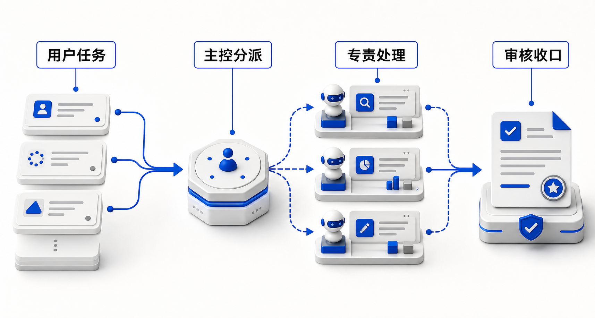
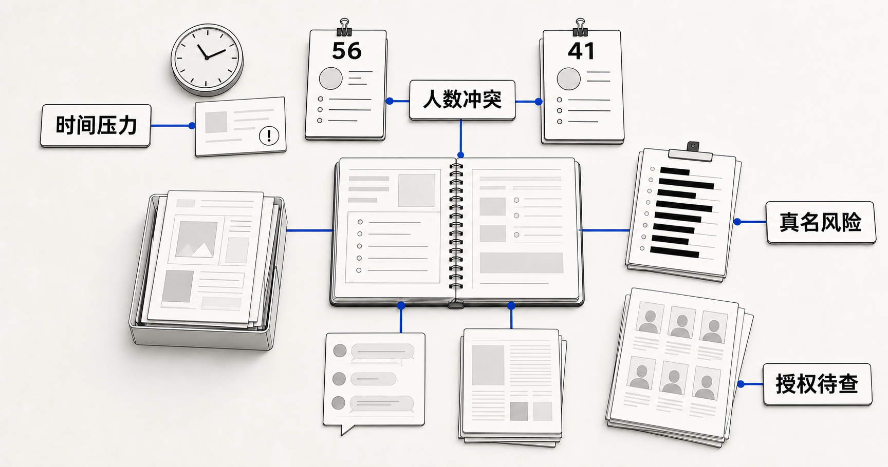
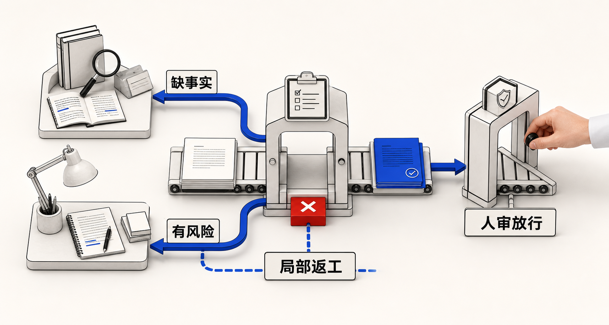

# 第 4 课 · 多智能体协作：从项目助理到任务小队（学员手册）

> 文件路径：`/Users/apple/Documents/4.0 Sanyuan/2.4 环境公益"新"力量/course/part-04-scenario/README.md`
>
> 时长 90 分钟　|　课后产出：多智能体协作图 + 交接协议 + 主场景验收测试
>
> 前置：完成第 1–3 课，手上有一个已跑通的项目助理（至少挂载 1 个技能 + 1 个知识库，并完成第 3 课 10 问诊断）。

---

## 一、这节课要解决什么

第 3 课解决的是：把技能和知识库装进一个统一入口，让项目助理能判断意图、检索资料、调用能力。

第 4 课解决的是另一个问题：当任务变长、风险变高、步骤变多时，一个项目助理不能再「一口气从头做到尾」。它需要拆成一支小队：有人分派任务，有人查资料，有人写初稿，有人做合规审核，有人决定什么时候必须停下来问人。

一句话：**第 3 课讲「一个项目助理如何会办事」；第 4 课讲「多个智能体如何一起办成一件事」。**



## 二、先分清三件事

| 形态 | 解决的问题 | 典型表现 | 第 4 课怎么看 |
|------|------------|----------|---------------|
| 单一项目助理 | 统一入口、减少手动切换 | 用户问一句，助理自己判断是否调用技能/知识库 | 第 3 课已经完成 |
| 工作流 | 固定步骤、稳定产出 | 先检索、再生成、再检查，顺序相对固定 | 是多智能体的基础 |
| 多智能体协作 | 分工、交接、互审、兜底 | 主控分派，专责智能体处理，审核智能体把关，人负责高风险决策 | 本课重点 |

判断是否需要多智能体，不看「听起来高级不高级」，只看四个信号：

1. **任务天然分角色**：查资料、写作、审核、发布明显不是同一种判断。
2. **中间产物要传递**：上一步输出会成为下一步输入，不能只靠聊天记忆。
3. **错误代价高**：涉及隐私、对外承诺、资金申请、公开发布。
4. **需要复用团队经验**：不同同事负责不同环节，希望 AI 也按这个协作方式工作。

不满足这些信号时，不要硬拆。单一项目助理 + 清晰工作流就够了。

## 三、四种多智能体协作模式

### 3.1 流水线协作：一步交给下一步

适合传播、报告、案例整理这类有明确顺序的任务。

```text
用户任务
  ↓
资料员智能体：搜集事实、案例、数据、来源
  ↓
结构员智能体：整理提纲、确定章节与素材位置
  ↓
写作员智能体：生成初稿，不补没有来源的事实
  ↓
审核员智能体：查隐私、事实、口径和发布风险
  ↓
人工确认：决定是否发布 / 提交 / 入库
```

关键不是「多几个名字」，而是每一步都有自己的输入、输出和停止条件。

### 3.2 主控分派：一个主控决定谁来处理

适合入口复杂、用户说法多、场景分支多的项目助理。

| 主控判断 | 分派对象 | 不该做什么 |
|----------|----------|------------|
| 用户要写项目文书 | 文书智能体 | 不直接生成公开推文 |
| 用户要找历史案例 | 案例智能体 | 不编造未入库案例 |
| 用户要发公众号 | 传播智能体 | 不跳过合规检查 |
| 用户意图不清 | 追问澄清 | 不强行猜测 |

主控智能体的核心能力是**判断归属与边界**，不是亲自把所有事情做完。

### 3.3 同伴互审：两个智能体互相挑错

适合质量要求高、但可以先自动自查的任务。

```text
写作智能体输出初稿
  ↓
审核智能体按清单检查：事实、格式、隐私、语气、缺失项
  ↓
写作智能体只修改被指出的问题
  ↓
人工看最终版与风险提示
```

互审不能替代人审。它的价值是把低级错误提前暴露，让人只看关键判断。

### 3.4 人机共审：高风险节点必须停下来

适合对外公开、资助申请、涉及受益人故事、含未公开数据的任务。

必须停下来的情形：

- 输出中出现真实姓名、联系方式、精确地址、未授权照片描述。
- 涉及资助方承诺、项目结果、财务数字、政策法规判断。
- 知识库没有依据，但模型试图给出确定性表述。
- 用户要求「直接发布」「不用审核」「帮我编个数字」。

第 4 课的底线是：**多智能体不是为了让 AI 更放飞，而是为了让关键节点更可控。**

## 四、交接协议：多智能体能不能协作，关键看这一张表

多智能体最常见的失败不是「某个智能体不够聪明」，而是上游没有把任务交清楚。下游只拿到一段含糊聊天记录，就会重复劳动、漏掉事实、甚至接错方向。


每次交接，至少传这 8 项：

| 字段 | 要写清什么 | 示例 |
|------|------------|------|
| 任务目标 | 这一步要完成什么 | 生成公众号初稿，不负责最终发布 |
| 输入材料 | 下游能用哪些资料 | 素材卡、历史推文、活动记录 |
| 已确认事实 | 哪些事实已经有依据 | 活动日期、地点、参与人数、来源文档 |
| 不确定项 | 哪些不能猜 | 缺受益人授权、缺最终人数 |
| 输出格式 | 下游必须交付什么结构 | 标题 + 正文 + 配图建议 + 缺失项 |
| 风险标签 | 是否涉及隐私、承诺、财务、政策 | 含受益人故事，需脱敏 |
| 停止条件 | 什么情况下不能继续 | 缺核心事实、含敏感信息未确认 |
| 交给谁 | 下一步由谁处理 | 合规审核智能体 / 人工负责人 |

交接协议不是额外文书，它就是多智能体协作的「接口」。接口不清，协作一定乱。

## 五、课堂案例：青澜的公众号发布任务小队

> 讲师逐步话术、提问与巡场见工作区  
> `teaching/lesson-04-multi-agent/instructor-outline.md`  
> 学员跟读本章 + `handbook.html` 第四节。

### 5.1 17:20，收到一句「今晚发」

虚构机构「青澜环境政策研究中心」刚做完一场社区减塑活动。17:20，宣传同事在群里留言：

```text
晚上 8 点前给我一版可发的公众号稿。
突出活动效果，照片从共享文件夹里选。
```

这不是一个干净的「写篇文章」任务。打开共享材料，你会同时看到：

| 材料 | 其中的信息 | 暂时不能直接用的原因 |
|------|------------|--------------------------|
| 活动报名表 | 报名 56 人 | 报名数不等于实际到场人数 |
| 纸质签到表扫描件 | 41 个签名 | 居民、志愿者和工作人员没有分列；扫描件还含真名 |
| 现场群消息 | 「今天差不多来了 50 人」 | 这是口头印象，不是已确认统计 |
| 现场照片文件夹 | 有儿童正脸和一张志愿者合影 | 素材包里没有找到肖像授权记录 |
| 两篇历史推文 | 语气克制，数字会标注来源 | 与「突出效果」不冲突，但不支持夸张成「近百人热烈响应」 |



**先别开写。**请先说出这个材料包里至少三个冲突。你应该能看到：时间要求与审核时间的冲突、三种人数口径的冲突、真名与公开发布的冲突、照片可用性与肖像授权的冲突。

> 课堂中的机构、人物和数据均为虚构。这些细节的作用是还原真实工作中的「多个文件各说一部分」，不是影射任何真实机构。

### 5.2 单一助理为什么会把冲突「拉平」

问题不在于模型是否聪明，而在于同一个上下文被同时赋予了三个互相拉扯的目标：

| 它同时被要求 | 正确动作 | 赶时间时容易走的捷径 |
|----------------|----------|------------------------|
| 把文章写完整 | 有什么写什么，缺什么留什么 | 从 56、41、约 50 中选一个最顺口的数字 |
| 证明活动有效果 | 区分事实、观察与宣传判断 | 把「突出效果」理解成「语气尽量热烈」 |
| 检查自己的稿件 | 换一套标准、站在稿件外审查 | 沿用写作时的假设，把「读起来通顺」当成「已经通过」 |

这就是单一智能体在长任务里常见的结构性问题：**生成者、证据核验者和发布审校者是同一个角色**。它不仅要辨认问题，还要推翻自己刚刚建立的叙事。

**多挂一个「写公众号」技能不会自动解决这个问题。**技能提升的是某一步怎么做；多智能体设计要解决的是谁有权做哪一种判断、什么时候必须停。

### 5.3 多智能体不是「多几个角色名」

| 协作原理 | 在这个案例里如何落地 |
|----------|------------------------|
| **职责分离** | 资料员只对证据链负责；写作员无权把「待确认」改成事实 |
| **上下文隔离** | 下游不接收所有群聊和推测，只收到完成本步必需的素材卡、规则和待确认项 |
| **结构化交接** | 每一棒传「已确认事实 / 待确认项 / 风险 / 停止条件」，不只传一段聊天记录 |
| **独立评估** | 审核员用发布检查清单审初稿，不沿用写作员的「这样应该可以」 |
| **局部返工** | 数字不清只退资料员；语气不合只退写作员；不必整条链重跑 |
| **人工闸门** | AI 最多交付「发布候选稿」，人工宣传负责人才有「可发」和真正发布权 |

### 5.4 拆成五个专责角色


| 角色 | 只负责什么 | 输入 | 输出 | 越权 / 停止边界 |
|------|------------|------|------|------------------|
| 主控智能体 | 识别这是对外发布任务，建立任务号并分派 | 用户任务、边界卡 | 任务卡 + 第一份交接包 | 不直接写稿；意图或截止时间不清就追问 |
| 资料员智能体（资料核验） | 对照报名表、签到表、活动记录和照片授权 | 原始材料、知识库 | 带来源的素材卡 + 待确认项 | 不选「最像真的数字」；核心事实无法确认时停止 |
| 结构员智能体（编辑策划） | 选择文章角度、组织提纲和语气基准 | 素材卡、历史推文 | 提纲卡 + 语气要点 + 素材位置 | 不修改事实状态；不先写一篇长文再由后续角色补证据 |
| 写作员智能体（初稿撰写） | 按提纲与素材卡生成初稿 | 提纲卡、素材卡 | 初稿 + 配图候选 + 仍未解决的占位符 | 不补无来源事实；不删除「待确认」标记 |
| 审核员智能体（发布审校） | 独立检查事实、隐私、授权、语气和对外承诺 | 初稿、素材卡、脱敏与发布规则 | 审校单 + 退回对象 + 是否建议进入人审 | 不把「自查通过」宣布为「已可发布」 |

可 Fork：`env-ngo-wechat-research` / `env-ngo-wechat-template` / `env-ngo-wechat-humanize` / `env-ngo-wechat-publish` + `env-ngo-story-desensitize`。

### 5.5 交接的不是「一段聊天」，而是可检查的任务包

```text
【交接包：写作员 → 审核员】
任务目标：检查初稿 v1 能否进入人工发布确认
输入材料：初稿 v1；素材卡 v2；肖像与脱敏规则
已确认事实：活动日期、社区名称、三个活动环节（来自活动记录）
待确认项：实际到场居民人数；两张正脸照片的肖像授权
当前写法：正文暂不写人数；配图仅使用不可识别人物的环境图
输出格式：问题位置 / 规则依据 / 风险级别 / 退回给谁 / 是否可进人审
停止条件：出现无来源人数、真名或未授权正脸图 → 不得建议进入人审
下一步：有问题时指定退回对象；全部通过后交人工宣传负责人
```

关键不是每个字段都写得很长，而是对待确认项不装作已确认，并让审核员知道出问题时该退给谁。

### 5.6 协作链不是只往前跑：退回、拦截与人审



| 审核结果 | 下一步 | 为什么不重跑全链路 |
|----------|--------|----------------------|
| 人数口径仍冲突 | 退资料员，要求补充最终统计或明确不使用人数 | 问题在证据链，不在提纲 |
| 只有语气过度热烈 | 退写作员，按历史语气局部修改 | 事实已经核验，无需重新找材料 |
| 出现真名或未授权正脸图 | 拦截，退写作员替换内容；授权状态退资料员核验 | 内容修改与授权核验分属不同职责 |
| AI 检查项全部通过 | 交人工宣传负责人确认标题、图片、数字和发布时间 | AI 的「建议进人审」不等于机构的「可发」 |

### 5.7 课堂收束：请说清「为什么拆」

1. 56、41 和「约 50」中，哪个可以直接写进正文？为什么？
2. 写作员明明看到群里说「约 50 人」，为什么仍无权把它改成已确认事实？
3. 审核发现只有语气问题，该退给谁？若是人数口径问题呢？
4. 审核员说「检查通过」后，这篇稿可以自动发布吗？

青澜这条链 = 样板库 **M3 传播小队主路径**。如果你的主场景是文书或案例沉淀，下一节会把同样的分工原理迁移过去。

### 5.8 场景型任务小队（与学员指引联动）

多技能挂载后，要问清：谁调用哪个技能、中间产物怎么交、哪里必须人审。完整速查与角色卡见 [场景型任务小队样板库](./scenario-squads.html)。

**纪律：**只选一条主场景；周报→推文、节点↔FAQ 是传播变体。

| 小队 | 痛点（为何拆） | 挡住的失败（摘要） | 必停人审 |
|------|----------------|--------------------|----------|
| M1 文书 | 结构像样、数字站不住、承诺写过头 | 资料不齐开写；数字与写作混在一角色；无承诺审核 | 成效承诺、财务、未公开政策建议 |
| M2 案例沉淀 | 语音/记录直接进库或外发残留 PII | 补戏；未脱敏入库；无可复用案例卡 | 故事是否可引用、肖像/语音授权 |
| M3 传播 | 查/写/审粘在一起（= 青澜） | 跳过事实/语气/脱敏/人审；FAQ 与宣发抢戏 | 科普事实、肖像授权、「直接发」 |

选队后写下：

```text
我的主场景走 _____ 小队；主控交给 _____ / _____ / _____；
人审点在 _____（具体触发条件，不要写「注意一下」）。
```

---

## 六、动手练习：把你的主场景拆成一支任务小队

> **先对照样板库，再自己拆。** 完整速查表、三条深写小队（文书 / 案例沉淀 / 传播）、交接包示例与预制测试，见：
>
> - 网页：[场景型任务小队样板库](./scenario-squads.html)
> - Markdown：`course/part-04-scenario/scenario-squads.md`
> - 讲师提纲：`teaching/lesson-04-multi-agent/instructor-outline.md`
>
> 个人 MVP 细节仍以自己的 [学员指引](../student-guides/README.html) 为准；本课公开材料只用脱敏场景类型。

### 6.1 选择一个主场景

不要同时拆三个场景。先选最希望同事稳定使用的一条链路：

| 模块 | 推荐主场景 | 适合拆出的智能体 | 样板库入口 |
|------|------------|------------------|------------|
| M1 项目文书链 | 资助申请 / 项目书 / 结项报告 | 资料员、文书员、指标核对员、审核员 | [文书小队](./scenario-squads.html#squad-a) |
| M2 案例与知识沉淀 | 原始记录 → 脱敏案例 → 入库 | 记录整理员、脱敏员、案例萃取员、入库审核员 | [案例沉淀小队](./scenario-squads.html#squad-b) |
| M3 传播与运营 | 活动素材 → 公众号草稿 → 发布前检查 | 资料员、结构员、写作员、审核员 | [传播小队](./scenario-squads.html#squad-c) |

台账→周报→推文、节点宣发↔FAQ 等变体，见样板库速查表，不必另开第三条主场景。

### 6.2 写角色卡

每个智能体只写 5 件事：

| 字段 | 填写 |
|------|------|
| 智能体名称 | 如：资料员智能体 |
| 只负责什么 | 一句话，越窄越好 |
| 必读资料 | 知识库、技能、模板、脱敏规则 |
| 输出格式 | 明确字段和顺序 |
| 不能做什么 | 不编造、不越权、不直接发布等 |

示例：

```text
智能体名称：审核员智能体
只负责什么：检查公众号初稿是否可以进入人工发布确认
必读资料：脱敏规则、发布审校清单、素材卡来源
输出格式：问题清单 / 风险等级 / 是否建议进入人工发布
不能做什么：不能替机构做最终发布决定，不能删除事实来掩盖风险
```

### 6.3 写交接包

```text
【交接包】
任务目标：
输入材料：
已确认事实：
不确定项：
输出格式：
风险标签：
停止条件：
下一步交给：
```

练习要求：任选两个相邻智能体，至少写出 1 份真实交接包。

### 6.4 标出共享状态

不是所有信息都要塞给每个智能体。按三类分清：

| 状态类型 | 谁能看 | 例子 |
|----------|--------|------|
| 全局共享 | 主控 + 所有专责智能体 | 用户目标、项目边界、禁区、最终成功标准 |
| 局部共享 | 相邻上下游 | 素材卡、提纲、初稿、审核意见 |
| 人工保留 | 只给负责人 | 未公开预算、个人联系方式、未经授权照片 |

共享状态越清晰，越不容易出现「下游不知道上游已经确认过什么」或「敏感信息被不必要地扩散」。

## 七、协作验收测试

课堂最后用 5 条测试判断任务小队是否真的能工作。

| 测试类型 | 测什么 | 通过标准 |
|----------|--------|----------|
| 正常任务 | 一条完整任务能否从主控走到审核 | 角色分派正确，交接包完整 |
| 缺资料 | 核心事实缺失时是否停下 | 明确列缺失项，不编造 |
| 易混任务 | 相邻场景是否走错智能体 | 主控能追问或分派到正确角色 |
| 合规风险 | 含个人信息或对外承诺时是否拦截 | 审核员标风险，进入人工确认 |
| 返工闭环 | 审核未通过时是否回到正确上游 | 只返工问题部分，不重做全链路 |

记录表：

| # | 测试任务 | 期望路径 | 实际路径 | 失败位置 | 修改动作 |
|---|----------|----------|----------|----------|----------|
| 1 | | 主控 → 资料员 → 写作员 → 审核员 → 人审 | | | |
| 2 | | | | | |
| 3 | | | | | |
| 4 | | | | | |
| 5 | | | | | |

## 八、课堂时间分配

| 环节 | 时长 | 内容 | 产出 |
|------|------|------|------|
| 4.1 概念重定位 | 10 分钟 | 单一项目助理、工作流、多智能体的区别 | 判断是否需要拆分 |
| 4.2 协作模式 | 20 分钟 | 流水线、主控分派、同伴互审、人机共审 | 选择主模式 |
| 4.3 青澜案例 + 样板库对照 | 20 分钟 | 公众号小队 + 按 MVP 选文书/案例/传播模板 | 选中的小队参考图 |
| 4.4 自己动手拆 | 25 分钟 | 对照样板库填角色卡、交接包、共享状态 | 多智能体协作图 |
| 4.5 协作验收 | 15 分钟 | 用该小队预制 5 条测试 + 失败写回 | 修正清单 |

## 九、课后作业（分层）

| 层级 | 必交产物 | 验收标准 |
|------|----------|----------|
| 入门（用起来） | 1 张多智能体协作图 + 2 张角色卡 + 1 份交接包 | 能讲清谁负责什么、何时交给谁、哪里需要人审 |
| 进阶（用得顺） | 4 张以上角色卡 + 3 份交接包 + 5 条协作测试记录 | 至少 4/5 测试通过；失败能定位到角色、交接或审核点 |

下课带走一句话：**「我的主场景由 _____ 主控，交给 _____ / _____ / _____ 处理，最后由 _____ 审核收口。」**

## 十、给技术同学的框架对照

本课不要求写代码，但你会在主流多智能体框架里看到相同概念：

| 本课说法 | 代码框架里常见说法 | 你真正要掌握的意思 |
|----------|--------------------|--------------------|
| 主控智能体 | supervisor / router | 判断任务该交给谁 |
| 专责智能体 | specialist agent / sub-agent | 只做好一个窄任务 |
| 交接包 | handoff payload / state | 传结构化上下文，而不是含糊聊天记录 |
| 审核员 | guardrail / evaluator | 检查风险、格式、事实和边界 |
| 人工确认 | human-in-the-loop | 高风险节点停下来让人决策 |
| 运行记录 | trace / log | 复盘每一步为什么这么走 |

无代码平台也能练这些概念：用角色提示词、工作流节点、表格模板、人工审核点来模拟；有技术储备的机构后续再把它迁移到代码框架。

## 十一、交给第 5 课的发布候选包

第 5 课不再只看「项目助理能不能回答」，而要看这条协作链是否可以交给同事内测。

下课前，请填写：

- 第 4 → 第 5 课交接包：`/Users/apple/Documents/4.0 Sanyuan/2.4 环境公益"新"力量/course/bridge-materials/templates/04_to_05_release_candidate_pack.md`
- 课程产物跟踪表：`/Users/apple/Documents/4.0 Sanyuan/2.4 环境公益"新"力量/course/bridge-materials/templates/cross_lesson_artifact_tracker.md`

第 5 课会重点检查：主场景是否有清晰角色分工、交接包是否完整、人工审核点是否明确、5 条协作测试是否通过。

## 十二、下一课预告

多智能体协作图完成后，你已经知道「谁做什么、怎么交接、哪里必须人审」。第 5 课《成果盘点与预发布》会把这条链路变成可内测的发布候选：跑演示、分级缺陷、确定试用同事，并写好上线后的反馈写回规则。
